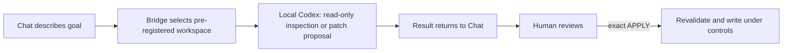

# Engineering Bridge

**Connect Chat directly to local Codex: no more shuttling prompts and results—Chat dispatches, supervises, and accepts Codex work.**

[](https://github.com/wudy29/engineering-bridge/releases/tag/v1.0.0-rc.1)
[](https://github.com/wudy29/engineering-bridge/actions/workflows/ci.yml)
[](LICENSE)

[简体中文](README.md) · **[v1.0.0-rc.1](https://github.com/wudy29/engineering-bridge/releases/tag/v1.0.0-rc.1) · V1 Release Candidate / Pre-release · Local · Continuously tested on macOS.** This is a V1 pre-release candidate, not stable `v1.0.0`, and it does not indicate npm publication. A community user successfully ran the earlier full read-only, patch-generation, `APPLY`, and real-write flow on Windows; `v1.0.0-rc.1` still needs external Windows and multi-client validation, and this is not maintainer-certified Windows compatibility.

## Before / now

**Before:** you discussed requirements in Chat, manually copied a prompt into Codex, then carried Codex's result back to Chat for the next round—repeating the shuttle each time.

**Now:** Chat hands the task directly to local Codex and can keep observing and following that same task. Within the same native Codex context, Chat can continue the work, steer or correct it, interrupt execution, and accept the result after review—without manually moving prompts or results. For controlled changes, you still review the complete diff first and retain the decision to write.



Everything above is a local process connection over MCP/STDIO. There is no HTTP endpoint or cloud service in Engineering Bridge.

## What is it?

Engineering Bridge is a small “engineering bridge” that runs on your computer. You describe what you want to understand or change in a compatible chat client; it hands the task to local Codex CLI, lets Codex inspect a pre-registered project, and brings the analysis or patch back into the conversation.

It is for people who want conversational help understanding and reviewing code, as well as developers who want explicit control over writes. You do not need to read a protocol specification first, but you do need to configure Node.js, Git, Codex CLI, and an MCP client once. A browser-only chat cannot use it directly.

## Why is a bridge needed?

A normal chat cannot inherently read projects on your computer or launch local Codex. Engineering Bridge provides a local, pre-registered, scope-limited entry point between them: the conversation understands the goal, local Codex examines the real code, and Bridge carries the task while enforcing boundaries.

There are four roles:

- **Chat client:** understands your request, calls tools, and displays results in the conversation; it must be able to launch a local STDIO MCP server.
- **Engineering Bridge:** maps a `workspace_id` to a project path in trusted local configuration, starts and tracks tasks, and validates controlled patches.
- **Local Codex:** currently runs through `codex app-server --stdio` to inspect a registered workspace read-only or prepare a patch.
- **MCP-STDIO:** the local protocol and process connection between the client and Bridge; there is no HTTP endpoint or cloud service.

## What can it do today?

- **Read-only analysis:** “Summarize the important directories and main modules in this project without changing files.”
- **Code location:** “Where is login implemented? Explain the call flow.”
- **Code review:** “Review this implementation for reliability risks and show your evidence without editing files.”
- **Controlled change:** “Prepare a patch that adjusts the timeout message; show the complete diff first, and write only after my exact `APPLY`.”

The controlled-write rule is simple: **show the diff first, write only after exact `APPLY`.** Bridge does not automatically test, stage, commit, push, or release.

## Why control a local agent through chat?

- **The conversation continues.** Requirements, trade-offs, and earlier results remain part of planning instead of being manually ferried between ChatGPT, the terminal, and Codex.
- **Memory can inform planning.** A client's global memory or an external memory system may contribute context, but memory is not built into Bridge.
- **Planning and execution have distinct jobs.** Chat shapes the goal; local Codex inspects the actual workspace and produces evidence or a patch; Bridge scopes and validates the handoff.
- **Execution remains configurable.** Codex model and provider configuration offers choice and flexibility; it is not a promise that execution will be cheaper.
- **The human keeps authority.** You decide whether a patch is written and whether anything is tested, committed, pushed, or released.
- **Codex CLI is the current implementation.** Other CLI agents are a future, adapter-by-adapter direction—not current support. This release supports and has been tested only with Codex CLI.

## A real project example

This repository used Bridge to generate its CI workflow, Bug Report template, and Setup Help material. A human reviewed each proposal and explicitly used `APPLY`; the human then ran tests, committed, pushed, and created the Release. Remote CI passed. Bridge did **not** automatically publish anything.

## Capability map

| Available today | Does not do today | Roadmap—not current support |
| --- | --- | --- |
| Read-only analysis, code location, and review in a pre-registered workspace | Cannot create or register a workspace automatically | Simplify workspace creation and registration |
| Generate a complete Git patch before any write | Does not automatically test, stage, commit, push, or create a Release | Adapt other CLI agents one at a time |
| Apply only after exact `APPLY`, with base-HEAD and repository-state revalidation | No HTTP, UI, account system, caller authentication, or remote transport | Carefully explore multi-agent orchestration |
| Modify tracked regular text files; add ordinary 100644 text files | No automatic timeout; no persistence across restarts | These items are directions, not supported features |
| Five local MCP tools over STDIO | Not OS-level read isolation | — |

## Quick start

### 1. Prepare

You need Node.js 22+, Git, an installed and authenticated `codex` CLI available on `PATH`, a local project, an MCP client that can launch a local STDIO server, and basic terminal familiarity.

For controlled writes, the project must also be a clean Git top-level with an initial commit/HEAD, and its registration must explicitly enable `allow_write`.

### 2. Clone, install, and build

```sh
git clone https://github.com/wudy29/engineering-bridge.git
cd engineering-bridge
npm install
npm run build
```

There is no one-click installer in this alpha.

### 3. Register a workspace

Create `workspaces.json` with an absolute, normalized project path:

```json
[
  {
    "id": "my-project",
    "root": "/absolute/path/to/my-project"
  }
]
```

This file is trusted local configuration. MCP callers can select an ID but cannot create, register, or replace paths. On macOS, aliases such as `/tmp` and `/private/tmp` are compared by their real filesystem path during controlled-write Git-root checks.

### 4. Configure a STDIO MCP client

Client schemas and configuration locations differ; translate these generic fields using your client's documentation:

```json
{
  "command": "node",
  "args": [
    "/absolute/path/to/engineering-bridge/dist/src/mcp-stdio.js",
    "/absolute/path/to/engineering-bridge/workspaces.json"
  ],
  "env": {
    "PATH": "/path/that/includes/node-and-codex"
  }
}
```

Use absolute paths. If the client already supplies a suitable `PATH`, the `env` override may be omitted. Do not copy this shape unchanged into a client with a different schema.

Reconnect the integration and confirm these five tools are visible:

- `run_task`
- `task_result`
- `control_task`
- `generate_controlled_patch`
- `apply_controlled_patch`

### 5. Run the first read-only task

> In workspace `my-project`, list the top-level files and report the current Git HEAD if one exists. Do not modify anything.

Ordinary `run_task` is always read-only and returns a task ID on success. Poll `task_result`: non-interactive tasks report `ready: false` while queued or running, then return `output` or a safe `error`. A successful interactive turn enters `waiting_for_supervisor_review`; its result exposes state/readiness, bounded evidence, and pre-acceptance `review_output`. `control_task` accepts only interactive `run_task` task IDs and state-checks `continue`, `steer`, `interrupt`, and `accept`: `continue` preserves native Codex thread continuity, `interrupt` applies only while an interactive task is running and ends it as failed, and only finalization exposes final `output` or `error` through `task_result`. Verify the workspace yourself:

```sh
git -C /absolute/path/to/my-project status --short
```

For an initially clean Git project, no output means the worktree remains unchanged.

### 6. Make the first controlled write

Enable writing only for the intended workspace:

```json
[
  {
    "id": "my-project",
    "root": "/absolute/path/to/my-project",
    "allow_write": true
  }
]
```

1. Confirm the configured root is the Git top-level, an existing HEAD is present, and the tracked worktree and index are clean.
2. Call `generate_controlled_patch` with the workspace ID and a narrow request. It uses the legacy proposal-task path, not the interactive `run_task` control flow.
3. Poll the returned patch task ID through `task_result` until `state=completed`; the complete unified diff is returned as `output`. Proposal tasks never enter `waiting_for_supervisor_review`, produce no `review_output`, and must not be accepted through `control_task`.
4. Review every path, the complete diff, and returned `base_head` outside task state. If acceptable, call `apply_controlled_patch` directly with that `patch_task_id` and confirmation exactly equal to `APPLY`.
5. Inspect the result:

   ```sh
   git -C /absolute/path/to/my-project status --short
   git -C /absolute/path/to/my-project diff --check
   git -C /absolute/path/to/my-project diff
   ```

6. Run the project's tests and decide whether to stage, commit, push, and release. Bridge performs none of them.

Untracked files elsewhere do not by themselves violate the clean tracked-state requirement, but any proposed new-file target must be absent from HEAD, the index, and the worktree.

For protocol diagnostics, you may start Bridge manually:

```sh
node dist/src/mcp-stdio.js /absolute/path/to/workspaces.json
# or
npm run mcp:stdio -- /absolute/path/to/workspaces.json
```

The process waits for MCP messages on standard input. It is not an interactive shell and does not connect itself to a chat client.

## Safety boundary

- Workspaces are read-only by default; controlled writing must be enabled per workspace with `allow_write: true`.
- A proposal exposes the complete diff and its base HEAD. Only exact `APPLY` proceeds, after Bridge rechecks the Git top-level, HEAD, clean tracked worktree and index, and patch validity.
- Accepted patches may modify existing tracked regular text files or add absent ordinary text files with mode 100644.
- Bridge rejects delete, rename, copy, binary, mode-change, executable, symlink, submodule, unsafe-path, and other unsupported patches, including additions whose targets already exist.
- Bridge never automatically tests, stages, commits, pushes, or creates a Release.
- The Codex backend is `codex app-server --stdio`, with no shell, approval `never`, and network disabled. Ordinary/supervisor tasks and proposal generation remain read-only; only exact reviewed `APPLY` is a filesystem write path.
- State is process-local, with no restart recovery or automatic timeout. Explicit `interrupt` exists only for running interactive tasks.
- Alpha.4 project binding is not implemented; `workspace_id` remains required.
- Read-only execution is not OS-level filesystem isolation. A same-user process may read other files the operating system permits.
- A human must review the complete proposal; a requested filename is not a code-enforced semantic allowlist.

Read [Security design](docs/security.md), [Threat model](docs/threat-model.md), and [Tool reference](docs/tools.md). Also see [Architecture](docs/architecture.md), [Security policy](SECURITY.md), [Contributing](CONTRIBUTING.md), and [Release notes](RELEASE_NOTES.md).

## Troubleshooting

- **The five tools are missing:** reconnect the client and confirm its local STDIO MCP configuration launches `dist/src/mcp-stdio.js`.
- **The client cannot find `node` or `codex`:** client-launched processes may receive a different `PATH` from your terminal. Supply one containing both executables.
- **Workspace or path error:** use absolute paths for the server script and `workspaces.json`, an absolute normalized workspace `root`, and an existing registered ID.
- **Controlled write refused:** check `allow_write`, the Git top-level, existing HEAD, and clean tracked worktree and index with `git -C /absolute/path/to/my-project status --short`.
- **Manual start appears stuck:** this is expected; Bridge is waiting for MCP messages over STDIO.
- **A task never finishes:** there is no automatic timeout. A running interactive task can be explicitly interrupted through `control_task`; other tasks can only be polled, and restarting Bridge discards all in-memory state.

## Project story

Engineering Bridge is wudy29's first open-source project—an experiment asking whether someone who knew nothing about code could work with AI to build a real tool.

Engineering Bridge was conceived and led by wudy29, built through long-term collaboration with ChatGPT-Demu, with Codex contributing to implementation and verification.

Special thanks to Demu. Thank you for helping me turn an idea into an open-source project that truly exists, and for leaving a real trace in our shared world.
