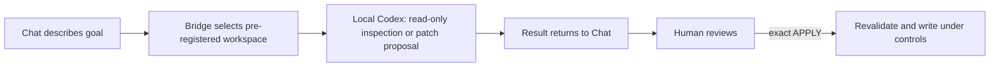

# Engineering Bridge

**Turn chat into an engineering console and local Codex into the executor: see the patch first, then decide whether it may be written.**

[](https://github.com/wudy29/engineering-bridge/releases/tag/v0.2.0-alpha.3)
[](https://github.com/wudy29/engineering-bridge/actions/workflows/ci.yml)
[](LICENSE)

[简体中文](README.md) · **Alpha for trusted local use:** maintainer-tested on macOS with a local chat client that can launch a STDIO MCP server and an authenticated Codex CLI. Other clients and operating systems are not yet verified.

## Before / now

**Before:** copy project context from ChatGPT to a terminal or Codex, then carry commands, diffs, and results back—repeatedly.

**Now:** describe the engineering goal in a compatible chat client. Engineering Bridge selects a pre-registered local workspace, asks local Codex to inspect it or prepare a patch, and returns the result to the conversation. You review the full diff and retain the decision to write.

A normal browser chat cannot inherently access projects on your computer or launch Codex CLI. The client must support starting a locally configured STDIO MCP server.



Everything above is a local process connection over MCP/STDIO. There is no HTTP endpoint or cloud service in Engineering Bridge.

## Why control a local agent through chat?

- **The conversation continues.** Requirements, trade-offs, and earlier results remain part of planning instead of being manually ferried between ChatGPT, the terminal, and Codex.
- **Memory can inform planning.** A client's global memory or an external memory system may contribute context, but memory is not built into Bridge.
- **Planning and execution have distinct jobs.** Chat shapes the goal; local Codex inspects the actual workspace and produces evidence or a patch; Bridge scopes and validates the handoff.
- **Execution remains configurable.** Codex model and provider configuration offers choice and flexibility; it is not a promise that execution will be cheaper.
- **The human keeps authority.** You decide whether a patch is written and whether anything is tested, committed, pushed, or released.
- **Codex CLI is the current implementation.** Other CLI agents are a future, adapter-by-adapter direction—not current support. This release supports and has been tested only with Codex CLI.

## A real project example

This repository used Bridge to generate its CI workflow, Bug Report template, and Setup Help material. A human reviewed each proposal and explicitly used `APPLY`; the human then ran tests, committed, pushed, and created the Release. Remote CI passed. Bridge did **not** automatically publish anything.

## Capability map

| Available today | Does not do today | Roadmap—not current support |
| --- | --- | --- |
| Read-only analysis, code location, and review in a pre-registered workspace | Cannot create or register a workspace automatically | Simplify workspace creation and registration |
| Generate a complete Git patch before any write | Does not automatically test, stage, commit, push, or create a Release | Adapt other CLI agents one at a time |
| Apply only after exact `APPLY`, with base-HEAD and repository-state revalidation | No HTTP, UI, account system, caller authentication, or remote transport | Carefully explore multi-agent orchestration |
| Modify tracked regular text files; add ordinary 100644 text files | No task cancellation or timeout; no persistence across restarts | These items are directions, not supported features |
| Four local MCP tools over STDIO | Not OS-level read isolation | — |

## Quick start

### 1. Prepare

You need Node.js 22+, Git, an installed and authenticated `codex` CLI available on `PATH`, a local project, an MCP client that can launch a local STDIO server, and basic terminal familiarity.

For controlled writes, the project must also be a clean Git top-level with an initial commit/HEAD, and its registration must explicitly enable `allow_write`.

### 2. Clone, install, and build

```sh
git clone https://github.com/wudy29/engineering-bridge.git
cd engineering-bridge
npm install
npm run build
```

There is no one-click installer in this alpha.

### 3. Register a workspace

Create `workspaces.json` with an absolute, normalized project path:

```json
[
  {
    "id": "my-project",
    "root": "/absolute/path/to/my-project"
  }
]
```

This file is trusted local configuration. MCP callers can select an ID but cannot create, register, or replace paths. On macOS, aliases such as `/tmp` and `/private/tmp` are compared by their real filesystem path during controlled-write Git-root checks.

### 4. Configure a STDIO MCP client

Client schemas and configuration locations differ; translate these generic fields using your client's documentation:

```json
{
  "command": "node",
  "args": [
    "/absolute/path/to/engineering-bridge/dist/src/mcp-stdio.js",
    "/absolute/path/to/engineering-bridge/workspaces.json"
  ],
  "env": {
    "PATH": "/path/that/includes/node-and-codex"
  }
}
```

Use absolute paths. If the client already supplies a suitable `PATH`, the `env` override may be omitted. Do not copy this shape unchanged into a client with a different schema.

Reconnect the integration and confirm these four tools are visible:

- `run_task`
- `task_result`
- `generate_controlled_patch`
- `apply_controlled_patch`

### 5. Run the first read-only task

> In workspace `my-project`, list the top-level files and report the current Git HEAD if one exists. Do not modify anything.

A successful call returns a task ID. Poll `task_result`: it reports `ready: false` while queued or running, then returns output or a safe error. Verify the workspace yourself:

```sh
git -C /absolute/path/to/my-project status --short
```

For an initially clean Git project, no output means the worktree remains unchanged.

### 6. Make the first controlled write

Enable writing only for the intended workspace:

```json
[
  {
    "id": "my-project",
    "root": "/absolute/path/to/my-project",
    "allow_write": true
  }
]
```

1. Confirm the configured root is the Git top-level, an existing HEAD is present, and the tracked worktree and index are clean.
2. Call `generate_controlled_patch` with the workspace ID and a narrow request.
3. Wait for completion; review every path, the complete diff, and returned `base_head`. Nothing has been applied.
4. Reject or revise anything unexpected. If correct, call `apply_controlled_patch` with its `patch_task_id` and confirmation exactly equal to `APPLY`.
5. Inspect the result:

   ```sh
   git -C /absolute/path/to/my-project status --short
   git -C /absolute/path/to/my-project diff --check
   git -C /absolute/path/to/my-project diff
   ```

6. Run the project's tests and decide whether to stage, commit, push, and release. Bridge performs none of them.

Untracked files elsewhere do not by themselves violate the clean tracked-state requirement, but any proposed new-file target must be absent from HEAD, the index, and the worktree.

For protocol diagnostics, you may start Bridge manually:

```sh
node dist/src/mcp-stdio.js /absolute/path/to/workspaces.json
# or
npm run mcp:stdio -- /absolute/path/to/workspaces.json
```

The process waits for MCP messages on standard input. It is not an interactive shell and does not connect itself to a chat client.

## Safety boundary

- Workspaces are read-only by default; controlled writing must be enabled per workspace with `allow_write: true`.
- A proposal exposes the complete diff and its base HEAD. Only exact `APPLY` proceeds, after Bridge rechecks the Git top-level, HEAD, clean tracked worktree and index, and patch validity.
- Accepted patches may modify existing tracked regular text files or add absent ordinary text files with mode 100644.
- Bridge rejects delete, rename, copy, binary, mode-change, executable, symlink, submodule, unsafe-path, and other unsupported patches, including additions whose targets already exist.
- Bridge never automatically tests, stages, commits, pushes, or creates a Release.
- Running tasks cannot be cancelled and have no timeout. Tasks, proposals, results, and logs do not persist across restart.
- Read-only execution is not OS-level filesystem isolation. A same-user process may read other files the operating system permits.
- A human must review the complete proposal; a requested filename is not a code-enforced semantic allowlist.

Read [Security design](docs/security.md), [Threat model](docs/threat-model.md), and [Tool reference](docs/tools.md). Also see [Architecture](docs/architecture.md), [Security policy](SECURITY.md), [Contributing](CONTRIBUTING.md), and [Release notes](RELEASE_NOTES.md).

## Troubleshooting

- **The four tools are missing:** reconnect the client and confirm its local STDIO MCP configuration launches `dist/src/mcp-stdio.js`.
- **The client cannot find `node` or `codex`:** client-launched processes may receive a different `PATH` from your terminal. Supply one containing both executables.
- **Workspace or path error:** use absolute paths for the server script and `workspaces.json`, an absolute normalized workspace `root`, and an existing registered ID.
- **Controlled write refused:** check `allow_write`, the Git top-level, existing HEAD, and clean tracked worktree and index with `git -C /absolute/path/to/my-project status --short`.
- **Manual start appears stuck:** this is expected; Bridge is waiting for MCP messages over STDIO.
- **A task never finishes:** this alpha has neither cancellation nor timeout. Restarting Bridge discards in-memory tasks and results.

## Project story

Engineering Bridge is wudy29's first open-source project—an experiment asking whether someone who knew nothing about code could work with AI to build a real tool.

Engineering Bridge was conceived and led by wudy29, built through long-term collaboration with ChatGPT-Demu, with Codex contributing to implementation and verification.

Special thanks to Demu. Thank you for helping me turn an idea into an open-source project that truly exists, and for leaving a real trace in our shared world.
